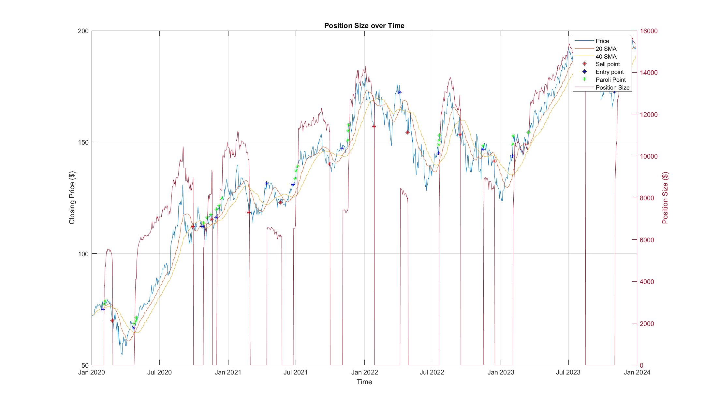
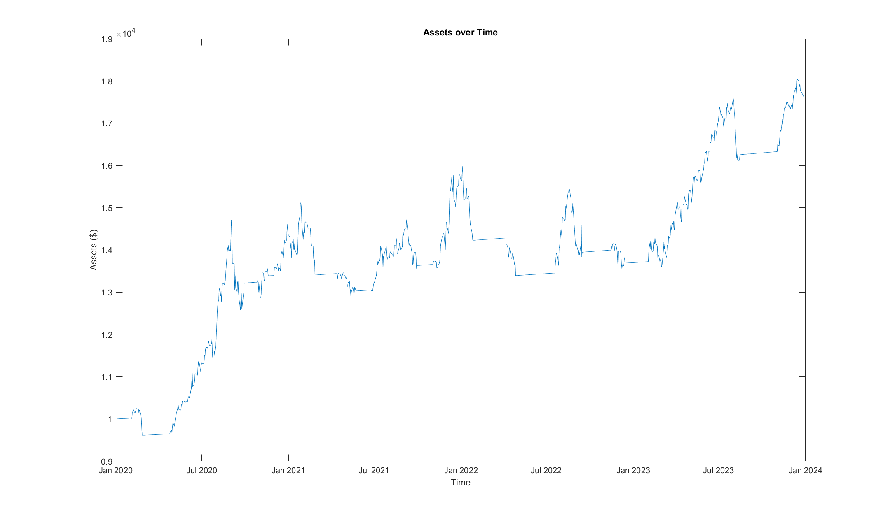
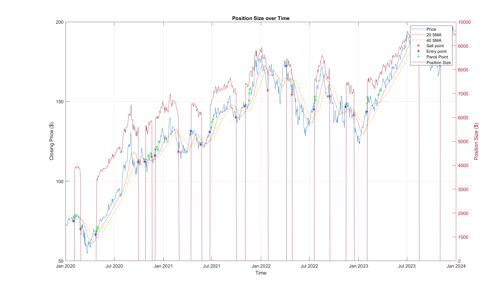
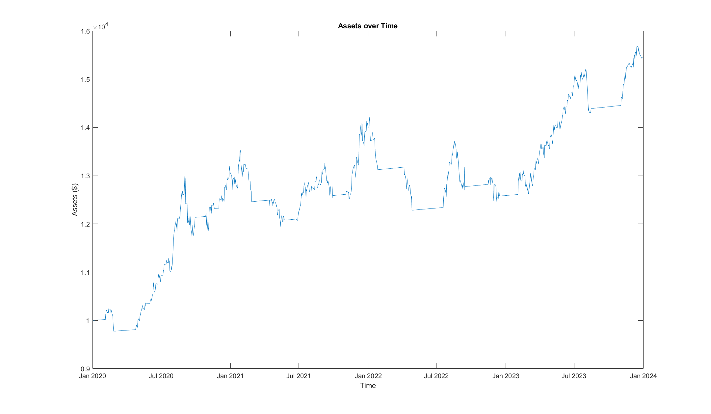

# Simple-Moving-Average Crossover Based Trading Algorithm with Paroli Implementation
### Introduction
This algorithm uses a 20-40 datapoint Simple-Moving-Average crossover mechanism with additional implementation of Paroli system for trading.

The objective of this study was to comprehend the performance of the Paroli system when implemented in an already robust 20-40 SMA crossover technique, as well as in a wider scope to compare the algorithm against others in terms of metric performance. The Paroli system has the ability to leverage on the bullish momentum of a stock to generate higher profits.

Paroli system can be summerized as a **betting system where you increase your bet after each successive win**, capitalizing on winning streaks. Think of it as the opposite of systems where you increase your bet after a loss (like the Martingale).
1. Start with a base bet size.
2. If you win, take your original bet plus your winnings and bet that larger amount in the next round.
3. If you lose (at any point), you go back to betting your original base bet size for the next round.
4. Often, people using Paroli set a limit (e.g., 2 or 3 consecutive wins). Once they hit that limit, they stop increasing their bet and go back to the base bet size, even if they win that round. This is to protect some of the profits made during the streak.

The 20-40 datapoint Simple-Moving-Average crossover is a commonly used technique in algorithmic trading to identify entries and exits. It generates a potential buy signal when the shorter-period 20-day SMA crosses above the longer-period 40-day SMA, suggesting increasing upward momentum. Conversely, a potential sell signal is generated when the 20-day SMA crosses below the 40-day SMA, indicating potential downward momentum.

In the script, the balance is split into two accounts; capital and outstanding position size. Capital is the leftover balance (cash account) and is subject to 3% interest capital gain; outstanding position size is the balance invested into stock, not subject to 3%.

This current version runs on historical data, taking $AAPL for study. Scraping live data from APIs can be expensive (hardware & software)!

### Usage
The user defined variables are detailed in the Starting Varible section.
1. capital = 10000; % Starting capital
2. upRisk = 0.01; % Upper limit for triggering Paroli
3. downRisk = 0.1; % Stop loss limit
4. paroliLotSize = 10; % How many lots for each paroli cycle
5. entryLotSize = 50; % How many lots for starting entry
6. maxParoliWins = 3; % Maximum Paroli cycles

The data loading is done at line #14, @**data = readtable('AAPL_historical_data.csv');**.

### Performance

##### AAPL from Jan 2020 to Jan 2024, showing 20&40 SMA, Sell, Entry, Paroli points, and oustanding position size. Paroli lot size @ 10 (10 addition lots invested per Paroli cycle).

##### Asset accumulation over time.
##### Balance at start of Jan 2024 (end): $17675.31177201533
##### CAGR: 15.3033%
##### Sharpe: 7.365238399486266

We can compare the performance of this configuration with a system with 0 Paroli lot size (effectively disabling the Paroli system).

##### AAPL from Jan 2020 to Jan 2024, showing 20&40 SMA, Sell, Entry, Paroli points, and oustanding position size. Paroli lot size @ 0 (0 addition lots invested per Paroli cycle).

##### Asset accumulation over time.
##### Balance at start of Jan 2024 (end): $15461.00870661287
##### CAGR: 11.5089%
##### Sharpe: 9.631431722044068

The algorithm with 10 lot Paroli outperforms 0 lot Paroli by 14.3% percent. Do note that this example is just one example, and greater sample size is needed for numerical valdiation. But this preliminary study shows the potential of such a system.

### Endnotes
The author plans to continue the study further by increasing the sample size as well as different configurations. This is part of a wider project to test different implementations of systems such as the Martingale system.
